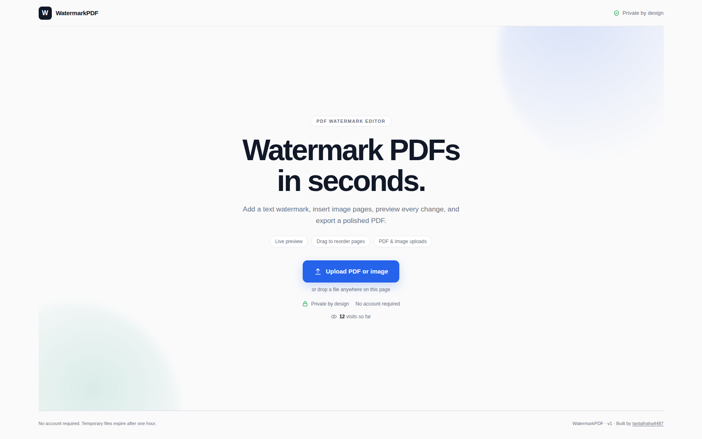

<h1 align="center">WatermarkPDF</h1>

<p align="center"><strong>A quiet signature for every page.</strong></p>

<p align="center">Built by <a href="https://github.com/tantaihaha4487">@tantaihaha4487</a></p>

<p align="center">
  Add precise vector text watermarks, turn images into PDF pages, arrange the
  final document visually, and export it from a clean self-hosted editor.
</p>

<p align="center">
  <a href="https://www.python.org/"></a>
  <a href="https://fastapi.tiangolo.com/"></a>
  <a href="https://mozilla.github.io/pdf.js/"></a>
  <a href="./frontend/app.js"></a>
  <a href="#quick-start"></a>
</p>



## Contents

- [Overview](#overview)
- [Highlights](#highlights)
- [Quick start](#quick-start)
- [How to use it](#how-to-use-it)
- [Supported input](#supported-input)
- [Rendering guarantees](#rendering-guarantees)
- [Privacy and limits](#privacy-and-limits)
- [API](#api)
- [Project structure](#project-structure)
- [Verification](#verification)
- [Contributing](#contributing)

## Overview

WatermarkPDF is a lightweight browser editor backed by FastAPI. Upload a PDF or
raster image, shape a centered multiline watermark, optionally insert more
images as document pages, reorder the pages by dragging them, and download the
finished PDF.

The project deliberately has no frontend build step. FastAPI serves plain
HTML, CSS, and JavaScript; PDF.js renders the browser preview; ReportLab creates
the vector watermark; pypdf merges and arranges pages; and pypdfium2 powers the
server-side exact preview check.

## Highlights

- **Full-screen landing hero** — a focused, centered upload screen greets new
  visitors; the editor workspace only appears once a document is uploaded.
- **Live all-page preview** — see the watermark across every page while editing.
- **Precise vector text** — multiline text stays centered on one shared axis and
  rotates as a single rigid block.
- **Image document support** — use JPEG, PNG, WebP, TIFF, GIF, or BMP as the
  source document.
- **Insert images as pages** — add one or several image pages anywhere in the
  document.
- **Drag-to-reorder pages** — move source and inserted pages into the exact final
  order; keyboard users can use `Shift` + `↑` or `↓`.
- **Animated placement feedback** — insertion markers and page transitions make
  drag-and-drop changes easy to follow, with reduced-motion support.
- **Thai-capable bundled fonts** — Kanit, Sarabun, Noto Sans Thai, Prompt, and
  Roboto are registered locally for export.
- **Short-lived uploads** — working files live in a temporary server directory
  and are automatically removed.
- **Visit counter** — a small persistent counter on the landing hero tracks
  total page loads.

## Quick start

### Requirements

- Python 3.11 or newer
- `python3-venv` or equivalent virtual-environment support
- Network access for the first Python dependency install
- Network access in the browser for the hosted PDF.js script and preview fonts

### Run

```bash
./run.sh
```

Open [http://127.0.0.1:8000](http://127.0.0.1:8000).

`run.sh` creates `.venv` when needed, installs the pinned dependencies from
`backend/requirements.txt`, and starts Uvicorn with reload enabled.

To select a specific Python interpreter:

```bash
PYTHON_BIN=python3.12 ./run.sh
```

### Run manually

```bash
python3 -m venv .venv
source .venv/bin/activate
python -m pip install --upgrade pip
python -m pip install -r backend/requirements.txt
python -m uvicorn backend.main:app --reload
```

## How to use it

1. **Choose a source document.** Drop a PDF or supported image into the first
   card.
2. **Shape the text watermark.** Edit the text, opacity, rotation, font, size,
   and color.
3. **Insert image pages when needed.** Browse for one or more images, or drop
   them between pages in the preview to choose their initial position.
4. **Arrange the document.** Drag the **Move** control below any page. Inserted
   image pages can be removed individually or all at once.
5. **Export.** Select **Apply & Download PDF**. The backend assembles the chosen
   order and applies the watermark to every final page.

Animated GIF frames and multi-page TIFF images become separate PDF pages.
EXIF orientation is applied before an image page is created.

## Supported input

| Input | Accepted formats | Behavior |
| --- | --- | --- |
| Source document | PDF, JPEG, PNG, WebP, TIFF, GIF, BMP | PDF is used directly; images are normalized into PDF pages |
| Inserted pages | JPEG, PNG, WebP, TIFF, GIF, BMP | Each image or frame becomes an insertable PDF page |
| Watermark text | Unicode text up to 5,000 characters | Rendered as vector text with the selected bundled font |

Encrypted PDFs are not supported. Unlock the document before uploading it.
Each uploaded file must be no larger than 50 MB.

## Rendering guarantees

For every final page, WatermarkPDF:

1. Reads that page's own media-box width and height.
2. Translates the ReportLab canvas to `(width / 2, height / 2)`.
3. Rotates the coordinate system once for the complete text block.
4. Splits multiline text using a `1.2 × font size` line height.
5. Draws every line centered at the same local `x = 0`.

Different line lengths therefore cannot move the watermark's horizontal center,
and mixed-size documents keep a correctly centered watermark on every page.
Rotation follows the PDF counter-clockwise convention, so the default `315°`
produces a bottom-left to top-right diagonal.

When the page order changes, the browser sends an explicit list of source pages
and inserted image pages. The backend validates that every source page appears
exactly once, builds the arranged PDF, and only then applies the watermark. The
download order therefore matches the editor order.

## Privacy and limits

- Uploads are stored only under `/tmp/watermarkpdf-uploads`.
- Temporary files are deleted when the server starts.
- A background sweep removes files older than one hour.
- Generated responses use `Cache-Control: no-store`.
- Uploaded document contents are not sent to the PDF.js or Google Fonts CDNs;
  those services only provide browser-side code and font assets.
- The server enforces the 50 MB upload limit, supported formats, page-order
  validation, font availability, color format, and control bounds.

For multi-user or internet-facing deployment, add authentication, HTTPS, rate
limits, isolated storage, and a production ASGI process manager.

## API

Interactive OpenAPI documentation is available while the app is running:

- Swagger UI: [http://127.0.0.1:8000/docs](http://127.0.0.1:8000/docs)
- OpenAPI JSON: [http://127.0.0.1:8000/openapi.json](http://127.0.0.1:8000/openapi.json)

| Method | Endpoint | Purpose |
| --- | --- | --- |
| `GET` | `/api/fonts` | List registered export fonts and Thai capability |
| `POST` | `/api/visit` | Increment and return the site's persistent visit count |
| `POST` | `/api/upload` | Upload and normalize a source PDF or image |
| `GET` | `/api/document/{file_id}` | Serve the normalized source document to PDF.js |
| `POST` | `/api/page-image` | Upload and normalize an image into insertable pages |
| `GET` | `/api/page-image/{image_id}` | Serve inserted image pages to PDF.js |
| `POST` | `/api/preview` | Render an exact PNG check of the arranged first page |
| `POST` | `/api/generate` | Arrange, watermark, and return the complete PDF |

### Page-order payload

The `page_order` field is optional when the source pages remain unchanged.
When pages are inserted or rearranged, each item identifies either an original
source page or one page from an uploaded image:

```json
{
  "file_id": "00000000-0000-4000-8000-000000000000",
  "text": "CONFIDENTIAL",
  "opacity": 30,
  "rotation": 315,
  "font": "Kanit",
  "font_size": 40,
  "color": "#808080",
  "page_order": [
    { "source_page": 2 },
    {
      "image_id": "11111111-1111-4111-8111-111111111111",
      "image_page": 1
    },
    { "source_page": 1 }
  ]
}
```

The UUIDs above are illustrative placeholders; use IDs returned by the upload
endpoints.

## Project structure

```text
WatermarkPDF/
├── assets/
│   └── site.png              # README product preview
├── backend/
│   ├── assets/fonts/         # Bundled export fonts
│   ├── fonts.py              # Font registration and metadata
│   ├── images.py             # Raster-to-PDF normalization
│   ├── main.py               # FastAPI routes and page assembly
│   ├── requirements.txt      # Pinned Python dependencies
│   └── watermark.py          # Vector watermark and exact preview pipeline
├── data/                     # Persistent app state (e.g. visits.json), gitignored
├── frontend/
│   ├── app.js                # Upload, preview, insertion, and reordering UI
│   ├── index.html            # Editor markup
│   └── style.css             # Responsive interface and animations
├── tests/
│   └── test_image_uploads.py # Upload, conversion, ordering, and export tests
├── run.sh
└── README.md
```

## Verification

Run the complete test suite:

```bash
.venv/bin/python -m unittest discover -s tests -v
```

Check the browser script syntax:

```bash
node --check frontend/app.js
```

The automated coverage includes:

- PDF source uploads
- PNG and WebP source conversion
- transparent PNG handling
- EXIF orientation
- animated GIF page conversion
- preview and final PDF generation
- inserted image-page upload
- reordered source and inserted pages in the exported PDF

## Contributing

1. Create a focused branch.
2. Keep the frontend dependency-free unless a build system is intentionally
   introduced.
3. Add or update tests for rendering, upload, or page-order behavior.
4. Run the verification commands above.
5. Open a pull request describing the user-visible change and its validation.

Issues and pull requests are welcome once this repository is published.
